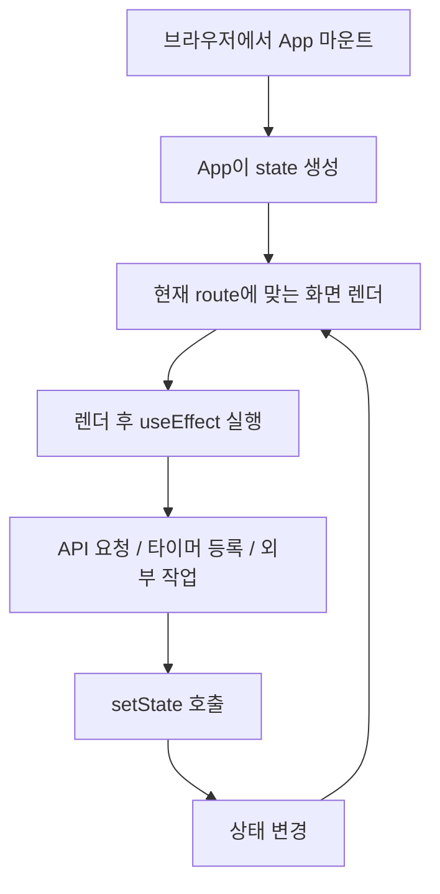
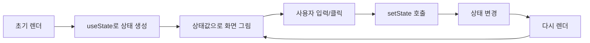
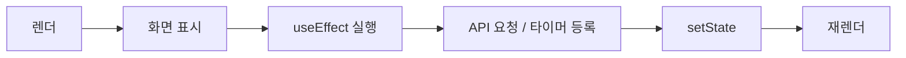
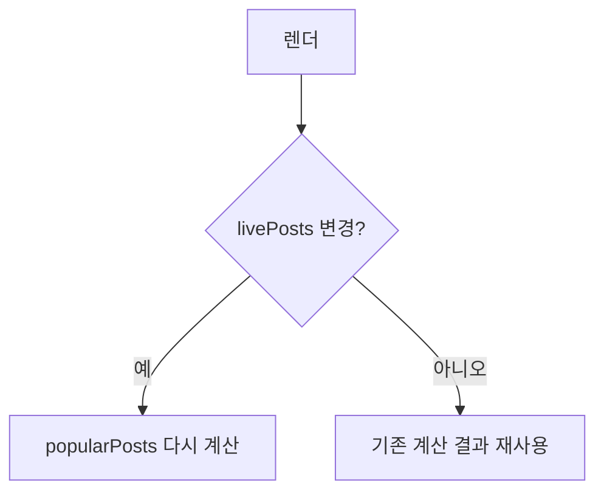
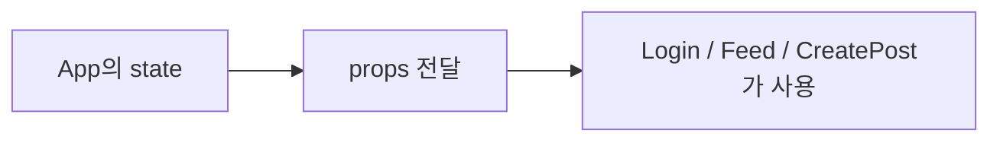
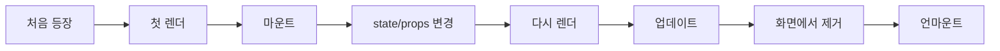
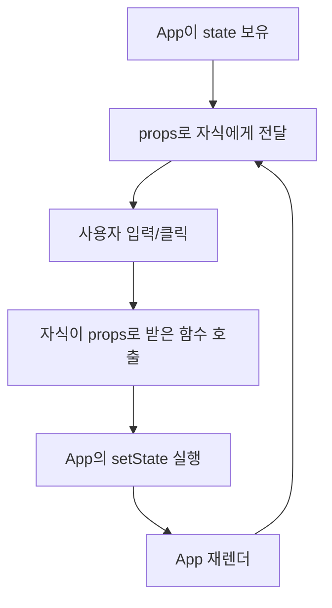

# Flicker

작은 SNS를 직접 만든 미니 React 스타일 프레임워크 위에서 구현한 학습용 프로젝트입니다.
로그인, 피드 조회, 글 작성, 좋아요, TTL(Time To Live) 카운트다운을 통해 `useState`, `useEffect`, `useMemo`, `props`, 마운트/렌더링 개념을 한 번에 익히도록 구성되어 있습니다.

## 한눈에 보기

- 프론트엔드: 직접 구현한 함수형 컴포넌트 + 훅 기반 렌더링
- 백엔드: `Express` 기반 인메모리 API 서버
- 주요 기능:
  - 닉네임 로그인
  - 실시간 피드 조회
  - 내 게시물 보기
  - 인기순 정렬
  - 게시물 TTL 10초 카운트다운
  - 좋아요 시 TTL 3초 연장
  - 이미지 포함 게시글 작성

## 이 프로젝트가 학습에 좋은 이유

이 프로젝트는 일반 React 앱을 사용하는 데서 끝나지 않고, `src/framework` 안에 훅과 렌더링 로직을 직접 구현해 두었습니다.
그래서 "상태가 왜 유지되는지", "effect가 왜 렌더 후 실행되는지", "memo가 왜 필요한지"를 코드로 따라가며 이해하기 좋습니다.

특히 다음 질문에 답하기 좋은 구조입니다.

- `useState`는 값을 어디에 저장하는가
- `setState`가 호출되면 왜 다시 렌더되는가
- `useEffect`는 왜 렌더 후 실행되는가
- `useMemo`는 어떤 계산을 아껴주는가
- 부모가 가진 상태가 `props`로 자식에게 어떻게 전달되는가

## 실행 방법

### 1. 의존성 설치

```bash
npm install
```

### 2. 개발 서버 실행

```bash
npm run dev
```

또는 일반 실행:

```bash
npm start
```

실행 후 브라우저에서 아래 주소로 접속합니다.

- [http://localhost:3000](http://localhost:3000)

## 폴더 구조

```text
5week-react/
├── public/
│   ├── index.html
│   └── styles/
├── server/
│   ├── index.js
│   └── seed.js
├── src/
│   ├── components/
│   │   ├── App.js
│   │   ├── Login.js
│   │   ├── Feed.js
│   │   ├── CreatePost.js
│   │   ├── Header.js
│   │   └── PostCard.js
│   ├── framework/
│   │   ├── component.js
│   │   ├── hooks.js
│   │   ├── router.js
│   │   ├── tracer.js
│   │   └── vdom.js
│   ├── services/
│   │   └── api.js
│   ├── test/
│   └── main.js
├── package.json
└── README.md
```

## 전체 흐름



핵심은 단순합니다.

- `useState`는 값을 기억합니다.
- `useEffect`는 렌더 후 해야 할 일을 실행합니다.
- `useMemo`는 계산 결과를 기억합니다.
- `props`는 부모가 자식에게 넘겨주는 값입니다.

## 핵심 컴포넌트 설명

### `App`

루트 컴포넌트입니다. 이 프로젝트의 대부분 상태가 여기에 모여 있습니다.

역할:

- 로그인 상태 관리
- 피드 데이터 관리
- 글 작성 상태 관리
- 라우트에 맞는 화면 선택
- 자식 컴포넌트에 `props` 전달

즉, `App`은 "상태 관리자", 나머지 컴포넌트는 "받아서 그리는 화면"에 가깝습니다.

### `Login`

로그인 화면을 그리는 순수 함수 컴포넌트입니다.
자기 상태를 직접 가지지 않고, `username`, `error`, `loading`, `onInput`, `onSubmit`을 `props`로 받아 렌더링합니다.

### `Feed`

실시간 피드, 인기순 피드, 내 게시물 탭을 보여주는 컴포넌트입니다.
현재 탭, 게시글 목록, TTL, 좋아요 진행 상태를 전부 `props`로 받아 화면만 구성합니다.

### `CreatePost`

텍스트/이미지 게시글 작성 화면입니다.
입력값과 로딩 상태, 에러 메시지를 직접 소유하지 않고 부모에게서 받습니다.

## 훅 개념 정리

### 훅(Hook)이란?

함수 컴포넌트 안에서 React 스타일 기능을 사용할 수 있게 해주는 `use...` 형태의 함수입니다.

이 프로젝트에서는 다음 훅을 직접 구현했습니다.

- `useState`
- `useEffect`
- `useMemo`

정리하면:

- `state`는 개념 이름입니다.
- `effect`도 개념 이름입니다.
- `useState`, `useEffect`, `useMemo`는 훅입니다.

## `useState`

`useState`는 컴포넌트가 기억해야 할 값을 저장하는 훅입니다.

형태:

```js
const [value, setValue] = useState(initialValue);
```

의미:

- `value`: 현재 상태값
- `setValue`: 상태를 바꾸는 함수

이 프로젝트에서 `useState`는 주로 `App`에서 사용됩니다.

예시:

- `loginUsername`: 로그인 입력값
- `loginLoading`: 로그인 요청 중인지 여부
- `livePosts`: 실시간 피드 목록
- `activeTab`: 현재 선택된 탭
- `postTtls`: 게시물별 남은 시간
- `createText`: 작성 중인 게시글 텍스트

흐름:



## `useEffect`

`useEffect`는 렌더가 끝난 뒤 실행할 작업을 등록하는 훅입니다.

주로 이런 작업에 사용합니다.

- 서버에서 데이터 가져오기
- 타이머 등록하기
- 이벤트 리스너 붙이기
- 정리 작업(cleanup) 하기

형태:

```js
useEffect(() => {
  // 실행할 작업
  return () => {
    // 정리 작업
  };
}, [deps]);
```

이 프로젝트에서 사용되는 대표 사례:

- 로그인 상태 확인
- 피드 초기 로드
- 3초마다 피드 폴링
- 1초마다 TTL 카운트다운

핵심 흐름:



## `useMemo`

`useMemo`는 계산 결과를 기억해두고, 의존값이 바뀔 때만 다시 계산하는 훅입니다.

형태:

```js
const memoizedValue = useMemo(() => {
  return expensiveCalculation();
}, [deps]);
```

이 프로젝트에서는 `livePosts`를 좋아요 많은 순으로 정렬한 `popularPosts` 계산에 사용합니다.

목적:

- 매 렌더마다 정렬하지 않기
- `livePosts`가 바뀔 때만 다시 계산하기

흐름:



## `props`

`props`는 부모 컴포넌트가 자식 컴포넌트에게 전달하는 값입니다.

쉽게 말하면 컴포넌트의 입력값입니다.

예를 들어 `App`은 상태를 가지고 있고, `Login`은 그 값을 `props`로 받습니다.



`props`로는 다음을 전달할 수 있습니다.

- 문자열
- 숫자
- 배열
- 객체
- 함수

이 프로젝트에서는 데이터뿐 아니라 이벤트 핸들러 함수도 `props`로 전달합니다.

예시:

- `username`
- `loading`
- `error`
- `onInput`
- `onSubmit`
- `onLike`

## 마운트, 렌더링, 업데이트, 언마운트

### 마운트(Mount)

컴포넌트가 처음 화면에 나타나는 순간입니다.

### 렌더링(Render)

컴포넌트를 실행해서 어떤 화면을 보여줄지 계산하는 과정입니다.

### 업데이트(Update)

이미 화면에 있는 컴포넌트가 상태나 `props` 변화로 다시 렌더되는 것입니다.

### 언마운트(Unmount)

컴포넌트가 화면에서 사라지는 것입니다.

정리 그림:



중요한 점:

- 모든 마운트에는 첫 렌더가 포함됩니다.
- 하지만 모든 렌더가 마운트는 아닙니다.

## 이 프로젝트에서 상태가 움직이는 방식



이 구조 덕분에 데이터 흐름이 한 방향으로 흘러서 이해하기 쉽습니다.

## 서버 동작 요약

`server/index.js`는 학습용 인메모리 서버입니다.

주요 기능:

- 로그인 처리
- 피드 조회
- 게시글 작성
- 좋아요 처리
- TTL 감소 및 만료 처리
- 테스트용 타이머 제어

특징:

- DB 없이 메모리에 데이터를 저장합니다.
- 서버에서 1초마다 TTL을 감소시킵니다.
- 좋아요를 누르면 게시글 TTL이 3초 늘어납니다.

## API 요약

### `POST /api/auth/login`

닉네임 로그인

### `GET /api/posts?username=...`

실시간 피드와 내 게시물 목록 조회

### `POST /api/posts`

새 게시글 작성

### `POST /api/posts/:id/like`

게시글 좋아요

## 학습 포인트 추천 순서

처음 읽을 때는 아래 순서로 보면 이해가 가장 잘 됩니다.

1. `src/main.js`
2. `src/components/App.js`
3. `src/framework/hooks.js`
4. `src/components/Login.js`
5. `src/components/Feed.js`
6. `src/components/CreatePost.js`
7. `server/index.js`

## 파일별 추천 관찰 포인트

### `src/main.js`

- `App`가 어디서 마운트되는지

### `src/components/App.js`

- 상태가 어디에 모여 있는지
- `useEffect`가 무엇을 하는지
- `useMemo`가 왜 필요한지
- 자식에게 어떤 `props`를 넘기는지

### `src/framework/hooks.js`

- `useState`가 상태를 어떻게 저장하는지
- `useEffect`가 왜 렌더 후 실행되는지
- `useMemo`가 어떻게 캐시되는지

### `server/index.js`

- 피드 데이터가 어떻게 만들어지는지
- TTL이 어떻게 감소하는지
- 좋아요가 왜 TTL을 늘리는지

## 마무리

이 프로젝트는 단순한 SNS 클론이 아니라, 프론트엔드 핵심 개념을 직접 눈으로 확인하기 위한 교육용 실습장에 가깝습니다.
특히 `App` 중심 상태 관리와 직접 구현한 훅 구조 덕분에 React의 핵심 철학을 배우기에 매우 좋은 코드베이스입니다.

다음 학습 단계로는 아래 순서를 추천합니다.

1. `App.js`에서 상태 흐름 따라가기
2. `hooks.js`에서 훅 저장 구조 이해하기
3. `server/index.js`에서 데이터 변화 확인하기
4. 직접 작은 상태 하나를 추가해 보기

## 복습용 요약본

이 섹션은 아래쪽에서 빠르게 다시 보는 용도로 정리한 압축 노트입니다.
순서는 "가장 자주 헷갈리는 것"에서 "연결해서 이해해야 하는 것" 순으로 배치했습니다.

### 1. 훅(Hook)

정의:

- 함수 컴포넌트 안에서 React 스타일 기능을 쓰게 해주는 `use...` 함수

비유:

- 기본 함수 컴포넌트에 기능을 끼워 넣는 확장 부품

이 프로젝트에서 활용된 것:

- `useState`
- `useEffect`
- `useMemo`

핵심 기억:

- `state`와 `effect`는 개념 이름
- `useState`, `useEffect`, `useMemo`는 훅

### 2. `useState`

정의:

- 컴포넌트가 기억해야 할 값을 저장하는 훅

비유:

- 칠판에 적어두는 현재 상태
- 또는 컴포넌트 안의 기억 창고

이 프로젝트에서 활용된 것:

- 로그인 입력값: `loginUsername`
- 로그인 에러/로딩: `loginError`, `loginLoading`
- 피드 목록: `livePosts`, `myPosts`
- 현재 탭: `activeTab`
- 게시글 TTL: `postTtls`
- 글 작성 입력값: `createText`, `createImageData`, `createPreview`

핵심 흐름:

- 상태 생성
- 상태로 화면 렌더
- 이벤트 발생
- `setState`
- 재렌더

한 줄 요약:

- `useState`는 "화면이 기억해야 하는 값"을 저장한다.

### 3. `useEffect`

정의:

- 렌더가 끝난 뒤 실행할 작업을 등록하는 훅

비유:

- 수업이 끝난 뒤 해야 하는 숙제나 정리 작업
- 화면을 먼저 보여주고 나서 뒤에서 움직이는 엔진

이 프로젝트에서 활용된 것:

- 로그인 상태 확인
- 피드 초기 로드
- 3초 폴링 타이머
- 1초 TTL 카운트다운
- 테스트용 전역 함수 등록 및 해제

핵심 기억:

- 렌더 중 실행이 아니라 렌더 후 실행
- `deps`가 바뀌면 다시 실행
- cleanup으로 이전 작업 정리 가능

한 줄 요약:

- `useEffect`는 "화면이 그려진 뒤 할 일"을 맡는다.

### 4. `useMemo`

정의:

- 계산 결과를 기억해두고, 의존값이 바뀔 때만 다시 계산하는 훅

비유:

- 전에 계산해둔 결과를 메모지에 적어두고 다시 꺼내 보기
- 매번 다시 풀지 않고 답안을 보관하는 방식

이 프로젝트에서 활용된 것:

- `livePosts`를 좋아요 순으로 정렬한 `popularPosts`

왜 썼는가:

- TTL 타이머 때문에 렌더는 자주 일어나도
- 정렬은 `livePosts`가 바뀔 때만 다시 하도록 하기 위해

한 줄 요약:

- `useMemo`는 "다시 계산할 필요 없는 값"을 아껴준다.

### 5. `props`

정의:

- 부모 컴포넌트가 자식 컴포넌트에게 전달하는 값

비유:

- 부모가 자식에게 건네는 전달물
- 컴포넌트 입장에서 보면 입력값

이 프로젝트에서 활용된 것:

- `App`이 `Login`, `Feed`, `CreatePost`에 데이터와 함수를 전달
- 예: `username`, `loading`, `error`, `onInput`, `onSubmit`, `onLike`

핵심 기억:

- 데이터도 `props`
- 함수도 `props`

한 줄 요약:

- `props`는 "부모가 자식에게 내려주는 값 묶음"이다.

### 6. 마운트(Mount)

정의:

- 컴포넌트가 처음 화면에 나타나는 순간

비유:

- 무대에 배우가 처음 등장하는 순간

이 프로젝트에서 떠올릴 예시:

- 앱이 처음 시작되어 `App`이 화면에 붙을 때
- `#/create`로 이동해 `CreatePost`가 처음 나타날 때

한 줄 요약:

- 마운트는 "처음 등장"이다.

### 7. 렌더링(Render)

정의:

- 컴포넌트를 실행해서 어떤 화면을 보여줄지 계산하는 과정

비유:

- 무대 배치도를 다시 그리는 작업

이 프로젝트에서 떠올릴 예시:

- 로그인 입력값이 바뀔 때
- TTL이 1초 줄어들 때
- 좋아요를 누른 뒤 피드가 다시 계산될 때

핵심 기억:

- 첫 렌더는 마운트와 함께 일어남
- 이후 렌더는 업데이트일 수 있음

한 줄 요약:

- 렌더링은 "화면 계산", 마운트는 "첫 등장"이다.

### 8. `state`와 `props` 차이

정의:

- `state`: 컴포넌트가 직접 가지고 있는 값
- `props`: 부모에게서 받은 값

비유:

- `state`는 내 가방 안 물건
- `props`는 부모가 건네준 준비물

이 프로젝트에서 보기:

- `App`은 `state`를 직접 가짐
- `Login`, `Feed`, `CreatePost`는 주로 `props`를 받아 사용

한 줄 요약:

- `state`는 내 것, `props`는 받은 것

### 9. 세 훅의 차이 한 번에 보기

| 개념 | 역할 | 비유 | 이 프로젝트 예시 |
| --- | --- | --- | --- |
| `useState` | 값을 기억 | 기억 창고 | `loginUsername`, `livePosts`, `postTtls` |
| `useEffect` | 렌더 후 작업 실행 | 뒤에서 움직이는 엔진 | 피드 로드, 타이머 등록 |
| `useMemo` | 계산 결과 캐시 | 미리 적어둔 답안 | `popularPosts` 정렬 결과 |

### 10. 시험 전 마지막 한 페이지 정리

- 훅은 `use...` 형태의 기능 함수다.
- `useState`는 값을 저장한다.
- `useEffect`는 렌더 후 작업을 실행한다.
- `useMemo`는 계산 결과를 재사용한다.
- `props`는 부모가 자식에게 넘기는 값이다.
- 마운트는 컴포넌트의 첫 등장이다.
- 렌더링은 화면을 계산하는 과정이다.
- 이 프로젝트는 `App`이 상태를 들고, 자식들은 `props`를 받아 그리는 구조다.
